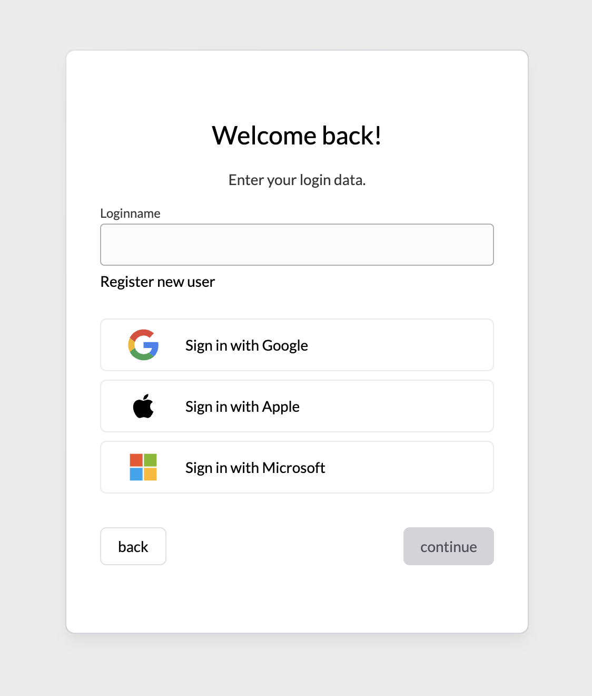

# ZITADEL Login UI

This is going to be our next UI for the hosted login. It's based on Next.js 13 and its introduced `app/` directory.

## Flow Diagram

> Back navigation or retrys are not displayed. The flows for reauthentication after registering Passkeys, OTP or U2F methods are not displayed either as these will be omitted in future UX.

```mermaid
    flowchart TD
    A[Start] --> register
    A[Start] --> accounts
    A[Start] --> loginname
    loginname -- signInWithIDP --> idp-success
    loginname -- signInWithIDP --> idp-failure
    idp-success --> B[signedin]
    loginname --> password
    loginname -- hasPasskey --> passkey
    loginname -- allowRegister --> register
    passkey-add --passwordAllowed --> password
    passkey -- hasPassword --> password
    passkey --> B[signedin]
    password -- hasMFA --> mfa
    password -- allowPasskeys --> passkey-add
    mfa --> otp
    otp --> B[signedin]
    mfa--> u2f
    u2f -->B[signedin]
    register --> passkey-add
    register --> password-set
    password-set --> B[signedin]
    passkey-add --> B[signedin]
    password --> B[signedin]
    password-- forceMFA -->mfaset
    mfaset --> u2fset
    mfaset --> otpset
    u2fset --> B[signedin]
    otpset --> B[signedin]
    accounts--> loginname
    password -- not verified yet -->verify
    register-- withpassword -->verify
    passkey-- notVerified --> verify
    verify --> B[signedin]
```

### /loginname

This page shows a loginname field and Identity Providers to login or register.
If `loginSettings(org?).allowRegister` is `true`, if will also show a link to jump to /register

Requests to the APIs made:

- `getLoginSettings(org?)`
- `getLegalAndSupportSettings(org?)`
- `getIdentityProviders(org?)`
- `getBrandingSettings(org?)`
- `getActiveIdentityProviders(org?)`
- `startIdentityProviderFlow`
- `listUsers(org?)`
- `listAuthenticationMethodTypes`
- `getOrgsByDomain`

After a loginname is entered, a `listUsers` request is made using the loginName query to identify already registered users.

**USER FOUND:** If only one user is found, we query `listAuthenticationMethodTypes` to identify future steps.
If no authentication methods are found, we render an error stating: _User has no available authentication methods._ (exception see below.)
Now if only one method is found, we continue with the corresponding step (/password, /passkey/login).
If multiple methods are set, we prefer passkeys over any other method, so we redirect to /passkey, second option is IDP, and third is password.
If password is the next step, we check `loginSettings.passkeysType` for PasskeysType.ALLOWED, and prompt the user to setup passkeys afterwards.

**NO USER FOUND:** If no user is found, we check whether registering is allowed using `loginSettings.allowRegister`.
If `loginSettings?.allowUsernamePassword` is not allowed we continue to check for available IDPs. If a single IDP is available, we directly redirect the user to signup.

If no single IDP is set, we check for `loginSettings.allowUsernamePassword` and if no organization is set as context, we check whether we can discover a organization from the loginname of the user (using: `getOrgsByDomain`). Then if an organization is found, we check whether domainDiscovery is allowed on it and redirect the user to /register page including the discovered domain or without.

If no previous condition is met we throw an error stating the user was not found.

**EXCEPTIONS:** If the outcome after this order produces a no authentication methods found, or user not found, we check whether `loginSettings?.ignoreUnknownUsernames` is set to `true` as in this case we redirect to the /password page regardless (to not leak information about a registered user).

> NOTE: We ignore `loginSettings.allowExternalIdp` as the information whether IDPs are available comes as response from `getActiveIdentityProviders(org?)`.
